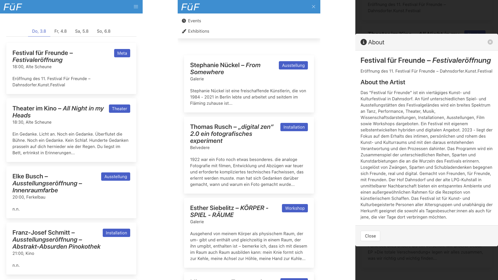

<div align="center" style="border-bottom: none">
  <h1>
    
    <br>
    feti
  </h1>
  <h2>Simple interactive timetable for conferences or festivals with NocoDB as backend</h2>
  <!--<p><a href="README-de.md">Deutsche Version</a></p>-->
</div>

Feti (for »festival timetable«) provides the guests of your event with a simple yet comprehensive timetable. Originally developed for an art festival feti should be usable for a wide range of festivals or conferences which consist of a number of sub-events like talks, concerts or performances. The Airtable alternative [NocoDB](https://nocodb.com/) is used as the backend to provide your team members with straightforward interface to manage the events.


## Features

- Manage all talks/performances of your event with ease in [NocoDB](https://nocodb.com/).
- Responsive, works on desktop and mobile alike.
- Events are sorted by day.
- Own section for installations or exhibitions which take place during the whole conference/festival.
- Detail view for each event containing additional information.




## Installation

Feti is written in Python (>=3.9) thus `python` and `pip` should be available on your system.


Then create the `.secrets.toml` from `secrets.tpl.toml`.

```
cp secrets.tpl.toml .secrets.toml
```

Modify the `.secrets.toml` as needed.


Take a look at the `settings.toml` file and modify it to suit your use case. Then install the package.

```
pip3 install -e .
```

You can then run your the application.

```
feti
```


## Configuration and Data model

The data for the timetable is loaded from your [NocoDB](https://nocodb.com/) instance. Your project should have the following structure:

- `timetable` (Table)
    - `when` (DateTime Field) _Date and time the event should take place. If not set the event is displayed in the permanent exhibition section._
    - `entry` (HasMany link Field to `entries`)
    - `location` (ManyToMany link Field to `location`)
- `entries` (Table)
    - `name` (SingleLineText Field) _Name of the artist/speaker/band/group._
    - `cv_artist` (LongText Field) _CV of/more information on the artist._
    - `title` (SingleLineText Field) _Title of the talk/event._
    - `description` (LongText Field) _Further description of the event's content._
    - `genre` (SingleSelect/SingleLineText Field) _Genre/track of the event._
- `location` (Table)
    - `name` (SingleLineText Field) _Name of the location._

You can alter the default names of the tables and fields in `settings.toml`. Please note that the `timetable -> entries` link is **Has Many** and `timetable -> location` is **Many to Many**.

