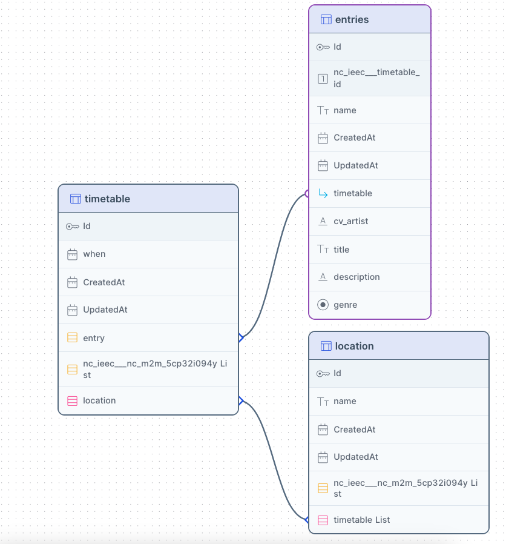

<div align="center" style="border-bottom: none">
  <h1>
    
    <br>
    feti
  </h1>
  <h2>Simple interactive timetable for conferences or festivals with NocoDB as backend</h2>
  <p><a href="README-de.md">Deutsche Version</a></p>
</div>

Feti (for »festival timetable«) provides the guests of your event with a simple yet comprehensive timetable. Originally developed for a art festival feti should be usable for a wide range of festivals or conferences which consist of a number of sub-events like talks, concerts or performances. [NocoDB](https://nocodb.com/) is used as the backend to provide your team members with straightforward interface to manage the events.


## Installation

Create the necessary data structure in NocoDB (see »Data model in NocoDB« below).

Then create the `.secrets.toml` from `secrets.tpl.toml`.

```
cp secrets.tpl.toml .secrets.toml
```

Modify the `.secrets.toml` as needed.


Take a look at the `settings.toml` file and modify it to suit your use case. Then install the package.

```
pip3 install -e .
```

You can then run your the application.

```
feti
```


## Data model in NocoDB

You can alter the default names of the tables and fields in `settings.toml`. Please note that the `timetable -> entries` link is **Has Many** and `timetable -> location` is **Many to Many**.

